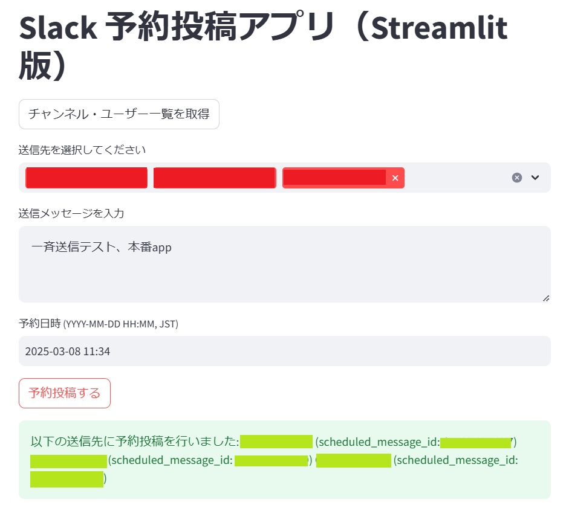

# Slack Schedule Wizard

Slack Schedule Wizard は、Slackへのメッセージを指定した日時に予約投稿できるStreamlitアプリです。  
複数のチャンネルやユーザーを一括選択し、JSTで指定した時刻にメッセージを送信することが可能です。

## 特徴

- **チャンネル一覧/ユーザー一覧の取得:**  
  パブリック・プライベートチャンネル、ワークスペース内のユーザー一覧を取得し、複数選択して予約投稿先を指定できます。

- **DM送信対応:**  
  ユーザーIDを選択すると、Botが自動的にDMチャネルを開き、予約投稿ができます。

- **日本時間対応:**  
  メッセージ投稿時刻をJST（日本標準時）で入力し、UTCタイムスタンプに変換してSlack APIへ送信します。

- **Streamlitによる直感的UI:**  
  Webブラウザから操作可能なシンプルでわかりやすいUIを備えています。

## デモ画像



## 必要な環境変数/Secrets

Slack BotのトークンやSigning Secretなど、機密情報はソースコードに直接書かず、環境変数またはStreamlitの[Secrets](https://docs.streamlit.io/streamlit-cloud/get-started/deploy-an-app/connect-to-data-sources/secrets-management)機能で管理してください。

- `SLACK_BOT_TOKEN`  
  Slack AppのBot Token (例: `xoxb-12345678-...`)
- `SLACK_SIGNING_SECRET`  
  Slack AppのSigning Secret (例: `abcd1234...`)

## インストールと実行

1. **リポジトリのクローン:**
   ```bash
   git clone https://github.com/your-username/slack-schedule-wizard.git
   cd slack-schedule-wizard
   ```

2. **依存パッケージのインストール:**
   ```bash
   pip install -r requirements.txt
   ```
   またはPoetryやPipenvなど、お好みのパッケージ管理ツールでもOKです。

3. **環境変数/Secretsの設定:**
   - ローカルで試す場合は、`.env` ファイルやシステム環境変数で `SLACK_BOT_TOKEN`, `SLACK_SIGNING_SECRET` を設定してください。  
   - Streamlit Cloudでデプロイする場合は、[Secrets管理](https://docs.streamlit.io/streamlit-cloud/get-started/deploy-an-app/connect-to-data-sources/secrets-management)を利用してください。

4. **アプリの起動:**
   ```bash
   streamlit run slack_scheduled_post.py
   ```
   ブラウザで表示されるURLにアクセスし、アプリを操作します。

## 使い方

1. アプリを開くと「チャンネル・ユーザー一覧を取得」ボタンが表示されるのでクリック  
2. Slackワークスペース内のチャンネル・ユーザー一覧が読み込まれる  
3. 送信先を複数選択し、メッセージ本文と予約日時（YYYY-MM-DD HH:MM, JST）を入力  
4. 「予約投稿する」ボタンを押下すると、指定時刻にSlackにメッセージが送信されます

## デプロイ (Streamlit Cloudの場合)

1. GitHubリポジトリをStreamlit Cloudと連携
2. 「New app」から本リポジトリを選択し、`slack_scheduled_post.py` を指定
3. Settings > Secrets で `SLACK_BOT_TOKEN`, `SLACK_SIGNING_SECRET` を登録
4. Deployすると、公開URLが発行されアプリが利用可能になります

## ライセンス

本リポジトリはMITライセンスのもと公開しています。詳細は[LICENSE](LICENSE)ファイルを参照してください。

## 貢献

IssueやPull Requestは歓迎です。バグ報告や機能提案など、お気軽にお寄せください。

---

Slack Schedule Wizard を活用して、Slack上での情報共有をよりスムーズにしましょう！
---

## ポイント

- **リポジトリ名・アプリ名の統一感**  
  `Slack Schedule Wizard` という名前を一貫して使用することで、わかりやすさとブランディングを高めます。

- **READMEの構成**  
  - プロジェクト概要  
  - 特徴/デモ  
  - 必要な環境変数（Secrets）  
  - インストール/実行手順  
  - デプロイ方法  
  - ライセンスや貢献ガイドライン

- **Secrets管理**  
  Slack Bot TokenやSigning Secretは公開リポジトリにハードコードしないようにし、StreamlitのSecretsまたは環境変数を利用する運用を推奨します。

これらを参考にしていただければ、リポジトリとアプリを分かりやすく整理しつつ、スムーズに開発・デプロイが進められるでしょう。  
